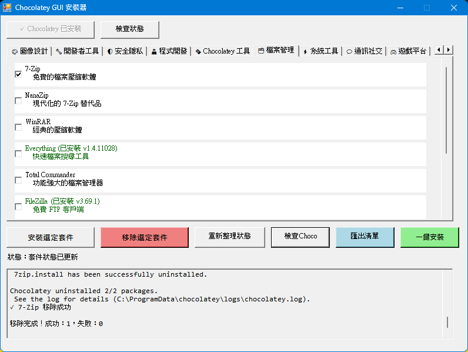
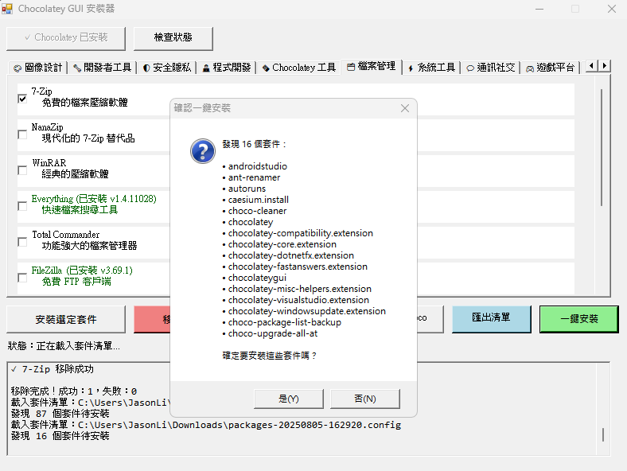

# Chocolatey GUI Installer (Avalonia 版)

本專案以 [Avalonia UI](https://avaloniaui.net/) 框架重寫，使用 .NET 9 並支援 AOT (Ahead-of-Time) 發布，僅支援 Windows 平台（x86 與 x64），提供現代化、直覺的套件管理圖形介面，方便用戶管理 Chocolatey 套件。

## 專案架構

- **Avalonia UI**：Windows 桌面應用程式
- **.NET 9 + AOT**：需安裝 .NET 9，並以 AOT 方式發布
- **packages-config.json**：軟體套件配置檔
- **packages-config-guide.md**：配置檔格式說明
- **匯入/匯出**：支援標準 packages.config 格式

## 主要功能

- 📦 套件分類瀏覽與管理
- ✅ 安裝/移除/更新套件
- 🔄 即時狀態同步
- 📤 匯出已安裝套件清單
- 📥 一鍵匯入並批量安裝
- 📝 完整安裝日誌與進度顯示
- ⚙️ 自訂安裝參數與後續命令
- 🚀 AOT 編譯，啟動更快、效能更佳
- 🖥️ 同時支援 Windows x86 與 x64

## 使用方式

### 安裝與啟動

1. 安裝 [.NET 9](https://dotnet.microsoft.com/download)
2. 下載本專案並執行 AOT 發布：
   ```shell
   dotnet publish ChocolateyGuiAvalonia/ChocolateyGuiAvalonia.csproj -c Release -r win-x64 --self-contained -p:PublishAot=true
   dotnet publish ChocolateyGuiAvalonia/ChocolateyGuiAvalonia.csproj -c Release -r win-x86 --self-contained -p:PublishAot=true
   ```
3. 執行產生的可執行檔（於 `bin/Release/net9.0/win-x64/publish/` 或 `bin/Release/net9.0/win-x86/publish/` 目錄）
4. 首次啟動請確認 `packages-config.json` 已正確配置

### 主要介面

- 直覺式分類標籤頁
- 每個套件顯示名稱、描述、安裝狀態、版本
- 支援批量安裝/移除
- 日誌區域即時顯示進度與詳細訊息



### 匯出/匯入功能

- 匯出已安裝套件為標準 packages.config
- 匯入 packages.config 並一鍵安裝所有套件



### 配置檔格式

請參考 [`packages-config-guide.md`](packages-config-guide.md) 文件。

## 系統需求

- Windows 10/11（x86 或 x64）
- .NET 9（AOT 編譯）
- 管理員權限
- 網路連線

## 故障排除

- 確認已安裝 .NET 9
- 檢查 `packages-config.json` 格式是否正確
- 查看日誌區域與終端輸出訊息
- 請以管理員權限執行

## 開發資訊

- 使用 Avalonia UI
- 僅支援 Windows x86/x64
- 支援中文介面
- 模組化架構，易於維護與擴充
- 採用 AOT 編譯，效能最佳
