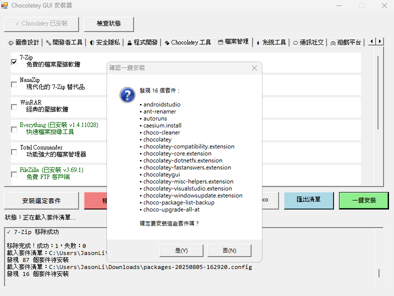

# Chocolatey GUI Installer 使用說明（Avalonia/.NET 9 AOT 版，僅支援 Windows x86/x64）

## 🚀 快速開始

### 啟動程式
```shell
dotnet publish ChocolateyGuiAvalonia/ChocolateyGuiAvalonia.csproj -c Release -r win-x64 --self-contained -p:PublishAot=true
dotnet publish ChocolateyGuiAvalonia/ChocolateyGuiAvalonia.csproj -c Release -r win-x86 --self-contained -p:PublishAot=true
```
- 於 `bin/Release/net9.0/win-x64/publish/` 或 `bin/Release/net9.0/win-x86/publish/` 執行產生的可執行檔
- 程式自動載入套件配置、檢查現有軟體狀態，並啟動 Windows 圖形化界面

## 📸 程式介面

### 主要界面


- 直覺分類標籤頁
- 顯示軟體名稱、描述、安裝狀態（綠色✓）、版本資訊

### 匯出/匯入功能


- 匯出已安裝套件清單為標準 packages.config 格式
- 支援環境備份、團隊同步、批量安裝

## 操作流程

1. **安裝 Chocolatey**（首次使用）
   - 點擊「安裝 Chocolatey」按鈕
2. **選擇軟體**
   - 瀏覽分類標籤頁，勾選要安裝的軟體
   - 已安裝軟體顯示綠色文字
3. **執行操作**
   - 點擊「安裝選定套件」或「移除選定套件」
   - 操作期間 UI 保持響應
4. **監控進度**
   - 日誌區域顯示即時輸出與進度
   - 操作完成後顯示成功/失敗統計

## ⚙️ 自訂配置

- `packages-config.json` 為必需配置檔，缺少時程式無法運行
- 新增軟體：編輯 `packages-config.json`，詳見 [`packages-config-guide.md`](packages-config-guide.md)
- 支援自訂安裝參數與後續命令

## 🛠️ 常見操作

- 重新整理狀態
- 檢查 Chocolatey 安裝
- 全選/取消全選
- 匯出清單
- 一鍵安裝

## 📤📥 匯出/匯入功能

### 匯出已安裝套件
1. 點擊「匯出清單」按鈕
2. 選擇儲存位置和檔名（.config 格式）
3. 產生標準 packages.config 檔案

### 一鍵安裝套件
1. 點擊「一鍵安裝」按鈕
2. 選擇 packages.config 檔案
3. 確認安裝列表並批量安裝

**檔案格式範例：**
```xml
<?xml version="1.0" encoding="utf-8"?>
<packages>
  <package id="vscode" version="1.85.1" />
  <package id="git" version="2.43.0" />
  <package id="nodejs" version="20.10.0" />
</packages>
```

## 系統需求

- Windows 10/11（x86 或 x64）
- .NET 9（AOT 編譯）
- 管理員權限
- 網路連線

## 📞 支援

如遇問題：
1. 查看日誌區域與終端輸出訊息
2. 確認以管理員權限執行
3. 檢查網路連線
4. 檢查 `packages-config.json` 格式
